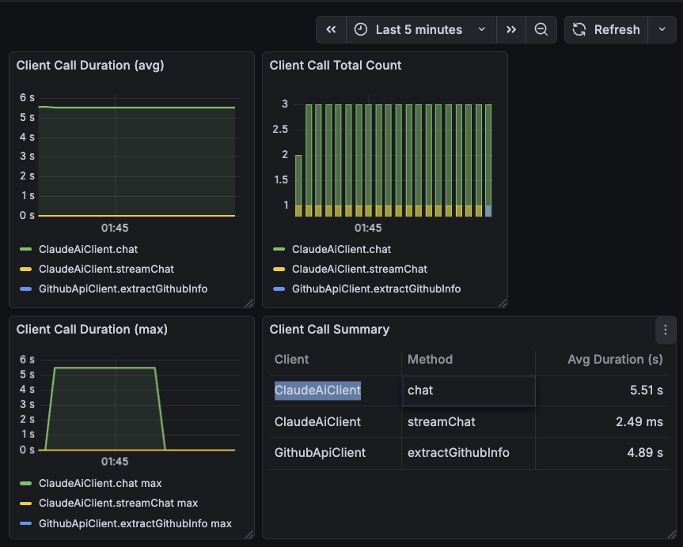
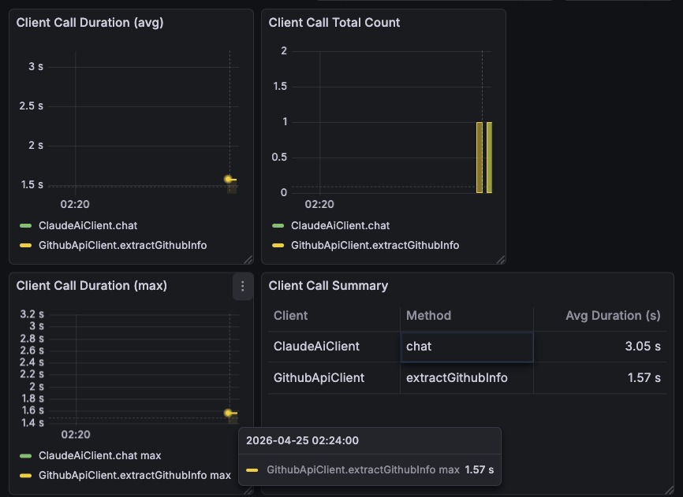

# InterviewAI — 인터뷰 시작 API 성능 최적화

## 개요

`POST /api/interviews` (인터뷰 시작) 요청이 최대 27초까지 블로킹되는 성능 이슈를 단계별로 최적화한다.

## 문제 분석

### 병목 구조

인터뷰 시작 시 3개 외부 시스템을 **동기 + 순차** 호출:

```
startInterview() — 단일 Tomcat 스레드에서 순차 블로킹
├─ jobCrawlerClient.crawl()              최대 10초 (Jsoup)
├─ githubApiClient.extractGithubInfo()   3~7초 (REST API × N)
│   ├─ GET /users/{username}
│   ├─ GET /users/{username}/repos
│   └─ GET /repos/{user}/{repo}/readme × 최대 10개 (순차)
└─ claudeAiClient.chat()                5~10초 (Gemini API 블로킹)
```

### 근본 원인

| 항목 | 상태 |
|------|------|
| @EnableAsync / CompletableFuture | 미사용 |
| Virtual Threads | 미활성화 |
| 외부 호출 병렬화 | 없음 |
| 첫 질문 스트리밍 | 미적용 (chatModel.call 동기) |

---

## 모니터링 인프라 (#47)

성능 전후 비교를 위한 측정 기반 구축.

### 기술 스택

- **Spring Boot Actuator** + **Micrometer** → `/actuator/prometheus` 메트릭 노출
- **AOP Aspect** → client 패키지 메서드 실행 시간 자동 측정 + Timer 메트릭 기록
- **Prometheus** → 5초 간격 메트릭 수집
- **Grafana** → Client Performance 대시보드 (프로비저닝 자동화)

### Grafana 대시보드

<!-- 스크린샷: Grafana Client Performance 대시보드 -->


---

## Baseline 측정 결과

| Client | Method | 평균 응답시간 | 비고 |
|--------|--------|-------------|------|
| ClaudeAiClient | chat | **5.51s** | 첫 질문 생성 (동기 블로킹) |
| ClaudeAiClient | streamChat | 2.49ms | 후속 대화 (스트리밍) |
| GithubApiClient | extractGithubInfo | **4.89s** | GitHub 정보 수집 (순차 REST) |

> AI 호출 + GitHub 호출만으로 **~10.4초** 소요. 채용공고 크롤링 추가 시 **~20초** 예상.

---

## 최적화 계획

### 1단계: GitHub README 병렬 fetch (#49) ✅

- **이슈**: [#49](https://github.com/handokei/interviewAI/issues/49) / **PR**: [#50](https://github.com/handokei/interviewAI/pull/50)
- **대상**: `GithubApiClient.appendRepositories()` 내 README fetch 순차 루프

#### 변경 전 (순차)

```java
for (Object repoObj : repos) {
    if (!Boolean.TRUE.equals(repo.get("fork"))) {
        appendReadme(result, username, (String) repo.get("name"));  // 블로킹 × N
    }
}
```

- 최대 10개 repo의 README를 **한 번에 하나씩** HTTP 호출
- 각 호출 ~500ms → 총 **~5초 소요**

#### 변경 후 (병렬)

```java
// 1. non-fork repo별 CompletableFuture 생성 (LinkedHashMap으로 순서 보장)
Map<String, CompletableFuture<String>> readmeFutures = new LinkedHashMap<>();
for (...) {
    readmeFutures.put(repoName, CompletableFuture.supplyAsync(
        () -> fetchReadme(username, repoName)
    ));
}

// 2. 모든 fetch 완료 대기 (30초 타임아웃)
CompletableFuture.allOf(readmeFutures.values().toArray(new CompletableFuture[0]))
    .orTimeout(30, TimeUnit.SECONDS)
    .join();

// 3. 결과 수집 (순서 유지)
for (Map.Entry<String, CompletableFuture<String>> entry : readmeFutures.entrySet()) {
    String readme = entry.getValue().join();
    if (readme != null) {
        result.append("  README: ").append(readme).append("\n");
    }
}
```

#### 기술적 의사결정

| 결정 | 이유 |
|------|------|
| `CompletableFuture.supplyAsync()` (ForkJoinPool) | 별도 ExecutorService 관리 불필요, README fetch는 경량 I/O |
| `LinkedHashMap` | repo 순서 보장 (HashMap은 순서 미보장) |
| `orTimeout(30초)` | 개별 README가 hang 걸려도 전체 요청이 영원히 블로킹되지 않도록 |
| `fetchReadme()` → null 반환 | 개별 실패가 다른 fetch에 영향 없음 (graceful degradation) |
| `StringBuilder` 쓰레드 안전 | fetch는 String만 반환, StringBuilder는 메인 스레드에서만 조작 |

#### 측정 결과

| Client.Method | Before | After | 개선 |
|---------------|--------|-------|------|
| GithubApiClient.extractGithubInfo | **4.89s** | **1.57s** | **-68% (-3.32s)** |




### 2단계: 외부 호출 병렬화

- **대상**: `InterviewServiceImpl.startInterview()` 내 crawl + github 순차 호출
- **방법**: `CompletableFuture`로 동시 실행
- **예상 효과**: 순차 13초 → 병렬 10초 (가장 느린 호출 기준)

### 3단계: 첫 질문 스트리밍 전환

- **대상**: `claudeAiClient.chat()` 동기 블로킹
- **방법**: 세션 생성 즉시 반환 → 첫 질문은 SSE 스트리밍
- **예상 효과**: 체감 대기 ~2초 (세션 생성만)

### 예상 총 효과

| 단계 | 전체 소요 시간 (worst) |
|------|----------------------|
| Baseline (현재) | ~27초 |
| 1단계 후 | ~22초 (-5초) |
| 2단계 후 | ~12초 (-10초) |
| 3단계 후 | 체감 ~2초 |

---

## 전후 비교

> 각 단계 완료 시 동일 조건으로 API 호출 → Grafana 대시보드 캡처

| 단계 | 스크린샷 | 결과 |
|------|---------|------|
| Baseline |  | extractGithubInfo **4.89s**, chat **5.51s** |
| 1단계 후 |  | extractGithubInfo **1.57s** (-68%) |
| 2단계 후 | | 예정 |
| 3단계 후 | | 예정 |
