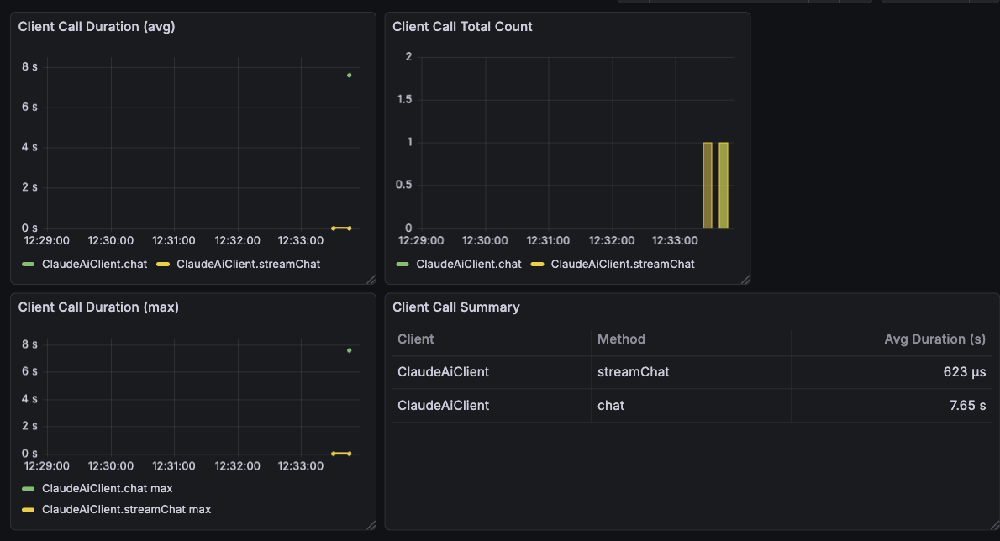
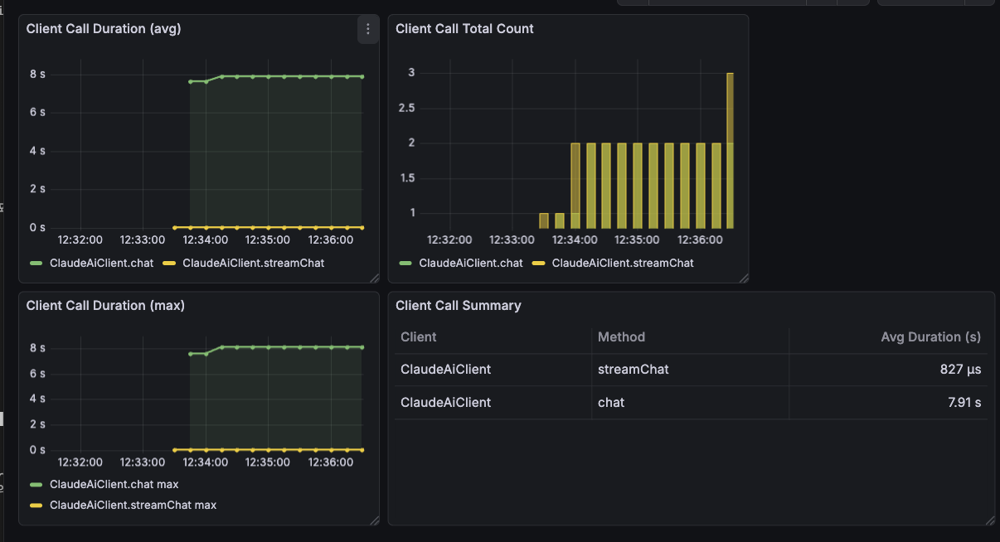
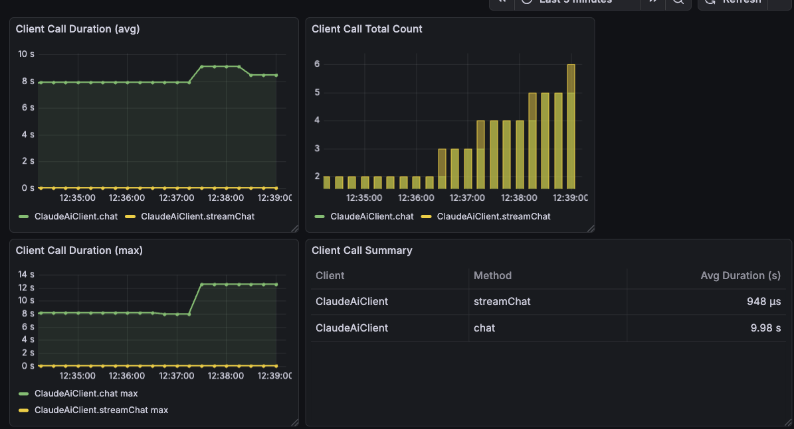

# Troubleshooting: AI 면접 메시지 전송 11초 병목

## 증상

- AI 면접 진행 중, 사용자가 답변을 전송하면 **"전송 중" 상태가 약 11초 이상 지속**
- AI 응답 토큰은 스트리밍으로 빠르게 도착하지만, 스트림 종료 후 `done` 이벤트까지 추가 지연 발생
- 사용자는 AI 답변이 화면에 다 표시된 후에도 다음 메시지를 보낼 수 없음

---

## 메트릭스 확인

Grafana 대시보드에서 `ClaudeAiClient` 메서드별 호출 시간을 측정한 결과:

> 이미지: `screenshots/evaluate-bottleneck-metrics.png`


| Client | Method | Avg Duration |
|--------|--------|-------------|
| ClaudeAiClient | `streamChat` | **20.1 ms** |
| ClaudeAiClient | `chat` | **11.7 s** |

- `streamChat` (스트리밍 응답): 20.1ms — 정상
- `chat` (동기 호출): **11.7초** — 병목 지점

---

## 원인 분석

### 핵심 원인: `evaluateWithAi()` 동기 블로킹

`InterviewServiceImpl.java`의 `streamMessage()` 메서드에서 스트리밍 완료 후 `evaluateWithAi()`가 동기적으로 AI API를 한 번 더 호출한다.

```java
// InterviewServiceImpl.java — streamMessage() 내부 doOnComplete
.doOnComplete(() -> {
    InterviewEvaluation eval = evaluateWithAi(session, history, aiContent.toString());
    interviewMessageSaver.saveAiMessageAndComplete(emitter, sessionId, aiContent.toString(), eval);
})
```

`evaluateWithAi()`는 면접 대화 히스토리 전체를 프롬프트에 포함하여 AI에게 평가를 요청하는 동기 `chat()` 호출이다.

```java
InterviewEvaluation evaluateWithAi(InterviewSession session, List<ChatMessage> history, String aiResponse) {
    String evalPrompt = buildEvalPrompt(session, history, aiResponse);
    String evalJson = claudeAiClient.chat(evalPrompt, List.of(), "위 지시에 따라 JSON으로만 응답해주세요.");
    return parseEvaluation(evalJson);
}
```

이 `chat()` 호출이 완료되어야 `saveAiMessageAndComplete()`가 실행되고, 그제서야 SSE `done` 이벤트가 프론트엔드에 전달된다. 프론트엔드는 `done` 이벤트를 수신해야 `isSending` 상태를 해제하므로, 그 사이 사용자는 다음 메시지를 보낼 수 없다.

### 체감 타임라인 (수정 전)

```
[0s]      사용자 메시지 전송
[0~0.5s]  DB 조회 (히스토리 + 문서) + 시스템 프롬프트 빌드
[0.5~5s]  AI streamChat → 토큰이 화면에 실시간 표시
[5~11.7s] evaluateWithAi() → AI chat 동기 호출 (11.7초 블로킹) ← 사용자 대기
[11.7s]   done 이벤트 → 프론트엔드 "전송 중" 해제
```

### 부가 요인

| 요인 | 위치 | 영향도 |
|------|------|--------|
| evaluation 프롬프트에 전체 대화 히스토리 포함 | `buildEvalPrompt()` | 대화 길어질수록 악화 |
| 매 요청마다 전체 메시지 + 문서 DB 조회 | `streamMessage()` | 미미 (ms 단위) |
| 요청마다 새 ExecutorService 생성 | `streamMessage()` | 미미 (리소스 비효율) |
| AI API 타임아웃 미설정 | `application.yml` | 장애 시 무한 대기 위험 |

### 원인 결론

> **스트리밍 자체(20.1ms)는 문제가 없다. 스트림 완료 후 `evaluateWithAi()`의 동기 `chat()` 호출(11.7초)이 `done` 이벤트 전송을 블로킹하여, 사용자가 다음 메시지를 보내지 못하는 병목이 발생한다.**

---

## 해결 방안 비교

3가지 접근 방식을 검토하였다.

### 방식 1: SSE 이벤트 분리 (done 즉시 + eval 후속)

**개념**: `done` 이벤트를 evaluation 전에 먼저 보내어 프론트엔드를 즉시 언블로킹하고, evaluation 완료 후 별도 `eval` 이벤트를 같은 SSE 스트림으로 추가 전송한다. emitter는 `eval` 전송 후 완료된다.

**변경 범위**: 백엔드 2파일 (`InterviewServiceImpl`, `InterviewMessageSaver`), 프론트엔드 2파일 (`interview.ts`, `InterviewSessionPage.tsx`)

| 장점 | 단점 |
|------|------|
| 변경량 최소 | SSE 커넥션을 evaluation 동안 계속 점유 (~16초) |
| 단일 SSE 스트림으로 일관성 유지 | emitter 타임아웃 위험 증가 (120초 이내라 당장은 안전하지만 마진 감소) |
| 프론트 변경이 `onDone`/`onEval` 콜백 분리 수준 | evaluation 실패 시 `eval` 이벤트가 도착하지 않을 수 있음 |
| DB 스키마 변경 불필요 | 스트리밍과 평가의 책임이 여전히 `InterviewServiceImpl`에 혼재 |

**트레이드오프**: 구현 속도는 가장 빠르지만, SSE 커넥션 점유 문제를 근본적으로 해결하지 못한다. 동시 사용자가 늘어나면 서버 리소스(스레드, 커넥션) 부담이 evaluation 시간만큼 증가한다.

---

### 방식 2: @Async + 별도 REST API (완전 분리) — 채택

**개념**: SSE 스트리밍과 AI 평가를 완전히 분리한다. 스트리밍 완료 즉시 `done` 이벤트를 전송하고 emitter를 완료하여 커넥션을 해제한다. 평가는 `@Async`로 별도 스레드풀에서 백그라운드 실행하고, 결과를 DB에 저장한다. 프론트엔드는 `done` 수신 후 별도 REST API(`GET /messages/latest-eval`)로 폴링하여 평가 결과를 조회한다.

**변경 범위**: 백엔드 8파일 (Entity, Config, Service, Controller, DTO 신규 포함), 프론트엔드 2파일

| 장점 | 단점 |
|------|------|
| SSE 커넥션 즉시 해제 (~5초) | 변경량 많음 (DB 스키마 + 서비스 + API + 프론트) |
| evaluation 실패해도 사용자에게 영향 없음 (fallback 저장) | 폴링으로 인한 추가 HTTP 요청 (2초 간격, 최대 15회) |
| 스트리밍과 평가의 책임 완전 분리 (SRP) | `InterviewMessage` 테이블에 eval 컬럼 추가 필요 |
| `@Async` 전용 스레드풀(`evalExecutor`)로 동시성 제어 가능 | 폴링 방식이므로 eval 결과 표시까지 최대 2초 지연 |
| 평가 로직 단독 테스트 가능 (`InterviewEvaluationServiceTest`) | |

**트레이드오프**: 구현 비용이 가장 높지만, SSE 커넥션 점유를 근본적으로 해소하고, 스트리밍/평가의 장애 격리가 가능하다. 폴링 비용은 경량 GET 요청(단일 row 조회)이므로 무시할 수 있다.

---

### 방식 3: WebSocket 전환

**개념**: SSE 대신 WebSocket으로 양방향 통신을 전환한다. 스트리밍 토큰, done, eval을 모두 WebSocket 메시지로 전송하며, 단일 커넥션을 면접 세션 전체에서 재사용한다.

**변경 범위**: 백엔드 전체 스트리밍 아키텍처 재설계, 프론트엔드 SSE → WebSocket 전환

| 장점 | 단점 |
|------|------|
| 양방향 통신으로 실시간 eval 전달 | 전체 아키텍처 변경 필요 (SSE → WebSocket) |
| 단일 커넥션 재사용 (핸드셰이크 1회) | Spring Security 인증 방식 변경 필요 (HTTP → WebSocket 핸드셰이크) |
| 폴링 불필요 | 현재 단방향(서버→클라이언트) 유스케이스에 과잉 설계 |
| | WebSocket 상태 관리, 재연결 로직 등 복잡도 대폭 증가 |
| | 로드밸런서/프록시의 WebSocket 지원 설정 필요 |

**트레이드오프**: 기술적으로 가장 우아하지만, 현재 유스케이스(AI → 사용자 단방향 스트리밍)에 비해 과잉이다. WebSocket의 양방향 특성이 필요한 기능(실시간 채팅, 협업 편집 등)이 추가될 때 검토할 가치가 있다.

---

### 기술적 의사결정

**방식 2(@Async + 별도 REST API)를 채택한 이유:**

1. **SSE 커넥션 점유 완전 해소** — 방식 1은 `done` 이벤트로 프론트를 언블로킹하지만 emitter가 evaluation 동안 ~16초 점유된다. 방식 2는 emitter를 즉시 완료하여 서버 리소스를 ~5초로 줄인다.

2. **장애 격리 (Fault Isolation)** — evaluation AI 호출이 실패하거나 타임아웃이 발생해도, 사용자의 스트리밍 응답과 메시지 저장에는 영향이 없다. `@Async` 내에서 catch하여 fallback 평가를 DB에 저장한다.

3. **단일 책임 원칙 (SRP)** — `InterviewServiceImpl`에 혼재되어 있던 스트리밍/평가 로직을 `InterviewEvaluationService`로 분리하여, 각 클래스가 하나의 역할만 담당한다.

4. **트랜잭션 경계 분리** — 스트리밍의 `@Transactional(REQUIRES_NEW)`와 평가의 `@Transactional`이 독립적으로 동작한다. 평가 트랜잭션 롤백이 메시지 저장 트랜잭션에 영향을 주지 않는다.

5. **WebSocket은 현 시점에서 과잉** — 현재 유스케이스는 서버→클라이언트 단방향 스트리밍이므로 SSE가 적합하다. WebSocket의 양방향 기능이 필요해지면 그때 전환을 검토한다.

---

## 해결 구현 상세

### 아키텍처 변경

SSE 스트리밍과 AI 평가를 완전히 분리하여, 스트리밍 완료 즉시 사용자를 언블로킹한다.

| 변경 | 내용 |
|------|------|
| `AsyncConfig` (신규) | `@EnableAsync` + `evalExecutor` 스레드풀 (core=2, max=4, queue=50) |
| `InterviewEvaluationService` (신규) | `@Async("evalExecutor")`로 `evaluateWithAi()` 로직을 별도 스레드풀에서 실행. 실패 시 `InterviewEvaluation.fallback()` 저장 |
| `InterviewMessage` 엔티티 | `answerLevel`, `suggestFinish`, `qualityHint` nullable 컬럼 추가 — 평가 결과를 AI 메시지 row에 저장 |
| `InterviewMessageSaver` | `saveAiMessageAndComplete()` 시그니처 변경 — eval 파라미터 제거, 저장된 AI 메시지 ID 반환 |
| `InterviewServiceImpl.doOnComplete()` | AI 메시지 저장 → `done` 이벤트 즉시 전송 → emitter 완료 → `evaluateAsync()` 트리거 |
| `GET /messages/latest-eval` (신규) | 프론트엔드가 폴링으로 평가 결과를 조회하는 REST API |
| 프론트엔드 `sendMessageStream` | `onDone` 콜백에서 `suggestFinish` 파라미터 제거 — 즉시 UI 언블로킹 |
| 프론트엔드 `InterviewSessionPage` | `onDone`에서 즉시 `isSending=false` + `pollEvaluation()` 호출 (2초 간격, 최대 15회) |

### 핵심 코드 변경

**수정 전 — doOnComplete (동기 블로킹):**
```java
.doOnComplete(() -> {
    InterviewEvaluation eval = evaluateWithAi(session, history, aiContent.toString());
    interviewMessageSaver.saveAiMessageAndComplete(emitter, sessionId, aiContent.toString(), eval);
})
```

**수정 후 — doOnComplete (즉시 완료 + 비동기 평가):**
```java
.doOnComplete(() -> {
    try {
        Long aiMessageId = interviewMessageSaver.saveAiMessageAndComplete(
                emitter, sessionId, aiContent.toString());
        interviewEvaluationService.evaluateAsync(
                aiMessageId, session, history, aiContent.toString());
    } catch (Exception e) {
        log.error("AI 메시지 저장 실패, emitter 강제 종료", e);
        emitter.completeWithError(e);
    }
})
```

### 변경 후 타임라인

```
[0s]      사용자 메시지 전송
[0~0.5s]  DB 조회 + 시스템 프롬프트 빌드
[0.5~5s]  AI streamChat → 토큰 실시간 표시
[5s]      done 이벤트 → "전송 중" 즉시 해제 + emitter 완료 (커넥션 해제)
          ↓ 사용자 즉시 다음 메시지 입력 가능
[5~15s]   @Async evaluateAsync() 백그라운드 실행
[5~15s]   프론트 폴링 (2초 간격) → evaluated=false 반복
[15s]     평가 완료 → DB 저장 → 다음 폴링에서 evaluated=true
          → suggestFinish=true면 종료 제안 UI 표시
```

---

## 수정 후 메트릭스 검증

### 첫 번째 테스트 (12:33)

> 이미지: `screenshots/evaluate-after-first-test.png`



| Client | Method | Avg Duration |
|--------|--------|-------------|
| ClaudeAiClient | `streamChat` | **623 µs** |
| ClaudeAiClient | `chat` | **7.65 s** |

- 비동기 분리 후 첫 호출. `chat`은 여전히 7.65초 소요되지만, 비동기로 실행되어 사용자 체감에 영향 없음
- `streamChat`이 20.1ms → 623µs로 감소한 것은 측정 시점 차이 (스트리밍 시작까지의 latency)

### 안정화 테스트 (12:36)

> 이미지: `screenshots/evaluate-after-stable.png`



| Client | Method | Avg Duration |
|--------|--------|-------------|
| ClaudeAiClient | `streamChat` | **827 µs** |
| ClaudeAiClient | `chat` | **7.91 s** |

- 여러 차례 호출 후에도 안정적으로 동작
- `chat` 평균이 7.91초로 수정 전(11.7초)보다 낮은 이유: 짧은 대화에서 테스트했기 때문

### 긴 대화 테스트 (12:39)

> 이미지: `screenshots/evaluate-after-long-conversation.png`



| Client | Method | Avg Duration |
|--------|--------|-------------|
| ClaudeAiClient | `streamChat` | **948 µs** |
| ClaudeAiClient | `chat` | **9.98 s** |

- 대화가 길어질수록 `buildEvalPrompt`에 전체 히스토리가 포함되어 `chat` 시간이 증가 (max 12~13초)
- 이는 부가 요인에서 지적한 "evaluation 프롬프트에 전체 대화 히스토리 포함" 문제
- 향후 Context Window 관리(토큰 카운팅 + sliding window)로 개선 가능

### 수정 전후 비교

| 항목 | 수정 전 | 수정 후 |
|------|---------|---------|
| 사용자 체감 응답 시간 | ~11.7초 | ~5초 (스트리밍 완료 시점) |
| SSE 커넥션 점유 시간 | ~16초 | ~5초 |
| "전송 중" 해제 시점 | evaluation 완료 후 | 스트리밍 완료 즉시 |
| evaluation 실패 시 영향 | emitter 오류로 전체 실패 | 사용자 무관 (fallback 저장) |
| 다음 메시지 입력 가능 시점 | ~11.7초 후 | ~5초 후 (스트리밍 완료 즉시) |

---

## 결과

> **사용자 체감 응답 시간이 11.7초에서 ~5초(스트리밍 완료 시점)로 단축되었다. `evaluateWithAi()`의 `chat()` 호출은 여전히 7~10초 소요되지만, `@Async`로 백그라운드에서 실행되므로 사용자는 스트리밍 완료 즉시 다음 메시지를 입력할 수 있다. SSE 커넥션 점유 시간도 ~16초에서 ~5초로 감소했다.**

---

## 잔여 과제

| 과제 | 설명 |
|------|------|
| Context Window 관리 | 대화가 길어질수록 `buildEvalPrompt`의 토큰 수가 증가하여 `chat` 시간이 악화됨. 토큰 카운팅 + sliding window 도입 필요 |
| AI 호출 Resilience | retry + circuit breaker 패턴 적용으로 API 장애 시 복원력 확보 |
| SseEmitter 콜백 미등록 | `streamMessage`, `streamFirstQuestion`의 emitter에 `onTimeout`/`onCompletion`/`onError` 콜백 미등록 — 별도 이슈로 분리 |
| 요청별 ExecutorService 생성 | 매 스트리밍 요청마다 `Executors.newSingleThreadExecutor()` 생성 — 공유 스레드풀로 전환 필요, 별도 이슈로 분리 |
